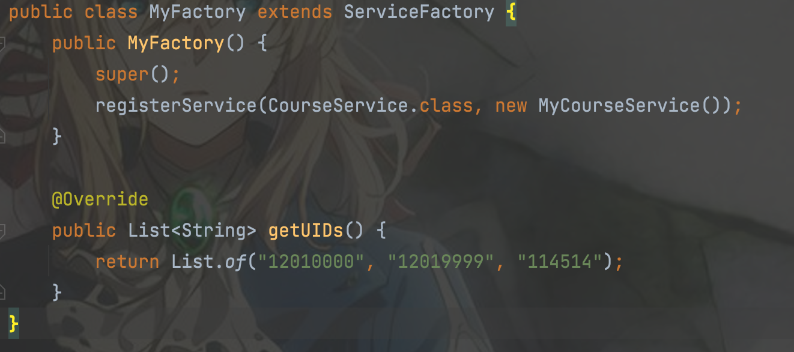

# **2022 Summer CS213 Project**

Contributors:

Zhu Yueming , Yu Tiancheng, Lu Hongyi, Wang Ziqin, Wang Weiyu, He Yirui, Yang Xiaosu, Chen Junfeng, Li Xin, Leng Ziyang, Niu Jingxuan, Qiu Yilun, Dai Guoyi


## **DDL**

Deadline date: 2022, August 4th 18:00

Presentation date: 2022,August 5th, Lab class


## **Overview**

It is a one-person group project. Each student should finish the project by himself/herself and submit **one report in PDF**.

------

You should submit a report and code before the deadline, the **Topscore will be 100（bonus, extra 10 points）**; for the report submitted after the date, the **score will be 0** .

**Please be honest**. DO NOT copy ANY words, figures, and others from the Internet and others.


## **Task**


### **Task 1: Database design**

Design a database by **PostgreSQL**  to manage all information mentioned in **course_info.json** and **select_course.csv** . Attention, there are some unreasonable data in these two files, correct them first. The total quantity of tables, the content in each table, all details should be determined by yourself.

Your design needs to meet the following **requirements**:

1. The tables created should satisfy the three normal forms;
2. Use the primary key and the foreign keys to indicate important attributes and relationships about your data. Every row in each table should be uniquely identified by its primary key;
3. Every table should be involved in a link. No isolate tables included;(每个表要有外键或者有其他表的外键指向，也就是说不能有孤立表)
4. Your design should contain no circular links; (对于表之间的外键方向，不能有环)
5. Each table should always have at least one mandatory (“Not Null”) column (including the primary key but not the system-generated ID column);（每个表格中必须包含有至少一个非空的属性列，主键属于这个范畴，但是自增ID不属于）
6. Tables with no other unique columns than possibly a system-generated ID is not allowed; (除了主键自增的id之外，需要有其他unique约束的列)
7. Use appropriate types for different fields of data;
8. Your design should better be as easy to expand as possible. 

### **Task 2: Import** **the** **data**

Design programs/scripts to import data into your database from those two files ( **course_info.json** and **select_course.csv**).

Your design needs to meet the follow the **requirements**:

1. Finding ways to improve the efficiency of time consuming during your importing process, and compare different importing methods.
2. Make sure all data are imported accurately , highly effectively and automatically . 

### **Task 3: Use DML to analyse your database in Task1**

Design some experiments to show your database's performance, and record the execution time. Significant expression, such as diagram, comparison will be welcome.

Your design needs to meet the following **requirements**:

1. The experiments should contain, but are not limited to these manipulation: SELECT、DELETE、UPDATE、INSERT.
2. The experiments should be designed reasonable, and comprehensive.

### **Task** **4: Compare database and file.**

Design programs/scripts to make the comparison between the database and the file. And design some experiments to discuss their advantages and disadvatages. Significant expression, such as diagram, comparison will be welcome.

Your design needs to meet the following **requirements**:

1. The programs/scripts could be any coding language if you like. 
2. The experiments should be designed reasonable and comparable.
3. Reasonable analysis of the results from your experiments should be given.

### **Task 5：Complete the Codes**

**Your work of this task is mainly divided into** **the** **following parts below:**

1. Implement the service and factory  interfaces to pass the basic testcases.
2. Design your (PostgreSQL) database to satisfy the requirements of interfaces.
3. Profile your implementation and find ways to speed it up.
4. (Optional) Find other ways to implement similar functionalities as our interfaces and compare (some of) them, are they better, worse, or have different use cases.
5. Make sure your results of codes will be **Correct(Most important)** and **Effective****.**

###  

### **Bonus**

1. High concurrency and transaction management;
2. User privileges management;
3. Database index and file IO;
4. Compare the performance of multiple databases with file system over different operating systems.
5. Some other effective explorations to improve efficiency of database system.


## **Report Structure**

### **Part 1. Personal Info**

Need to write down your name and sid.

### **Part 2. Task 1** 

Provide a **clearly formatted** diagram of the table structure generated by DataGrip.

         

Give clear explanations for the design of your database, tables, and some of columns (if needed).

### **Part 3. Task 2**

Introduce how to design the programs/scripts of importing data, and give the core codes of your scripts.

Introduce how to improve the efficiency of importing data and give the core codes. You can design some experiments to improve the efficiency in your work. Make sure that the experiments should be reasonable, and the improvements should be obvious.

### **Part 4. Task 3**

Provide the performance analysis of your database designed in Project Part1 clearly.

### **Part 5. Task 4**

Provide the comparison between the database and the file system using programs/scripts.  Analyse the results of your experiments designed.

### **Part 6. Task 5**

Show your results of the completed codes.

### **Part 7. Bonus**

Discuss your explorations of the bonus part.


## **Code packaging and submission**


### **A Brief User Manual**

**Step 1:** Open Project in IDEA.

​                         

**Step 2:** Design your database.

Please make sure your database can **be rebuilt by the sql file and work properly**.

**Step 3:** Create your package and classes that implement interfaces in **cn.edu.sustech.cs307.service**.                         

​                         

**Step 4**: Create your Factory that extends from **cn.edu.sustech.cs307.factory.ServiceFactory** and register your service implements in the constructor:

Take CourseService as an example:

​                         

After registering all implementation:

​                         

For better judgment, please override getUIDs in your ServiceFactory implementation. This function should return your group members' student ids:

​                         

**Step 5:** Modify the setting files (**config.properties**) as follows:

```
serviceFactory=me.yourname.impl.MyFactory
jdbcUrl=jdbc:postgresql://localhost:5432/project3
username=****
password=****
```


**serviceFactory** is the path of your **ServiceFactory**.

**Step 6:** Run the benchmark, and debug by yourselves.

You can refer to the reference implementation result in data/sampleResult.txt:

*Import departments Import majors Import users Import semesters Import courses Import sections Import classes Import major courses Import time usage: 2.46s Test search course 1: 1000 Test search course 1 time: 0.53s Test enroll course 1: 1000 Test enroll course 1 time: 0.30s Test drop enrolled course 1: 813 Test drop enrolled course 1 time: 0.03s Import student courses Import student courses time: 14.19s Test drop course: 416637 Test drop course time: 4.75s Test course table 2: 1000 Test course table 2 time: 0.72s Test search course 2: 1000 Test search course 2 time: 0.48s Test enroll course 2: 1000 Test enroll course 2 time: 0.17s*

The integer after each test case is the number of your correct results. Your program should give out exactly the same result as the reference implementation.


### **Interface Specification**

The structure of the interfaces is as follows.

- **database** folder stores connection information such as username, password, url, we only provides **PostgreSQL** as the DBMS.
- **dto** folder stores a set of data objects that will be accessed by the interfaces. Your implementations will use them as parameters or returned values.
- **service** folder stores **Service Interfaces**, this is the folder you should pay special attention to. There exist multiple **.java** file where the interface signatures are stored. You need to implement you own **class** to fit these signatures.
- **exception** folder stores exceptions that you should **throw** if something went wrong.
- **factory** folder stores the **ServiceFactory** abstract class that you need to implement to create your service instances.

Limited by time of summer semester, the classes exactly should be implemented will be reduced to **CourseServiceImplementation** and **StudentServiceImplementation.** Here is a reference implementation, it shows how to implement one method of an interface.

*The following code is just a guide, the code**s* *interacts with database will usually be written in the DAO layer*


```
@ParametersAreNonnullByDefault
public class ReferenceStudentService implements StudentService {
    /* Some codes are omitted */
    @Override
    public void dropCourse(int studentId, int sectionId) {
        try (Connection connection = SQLDataSource.getInstance().getSQLConnection();
            PreparedStatement stmt = connection.prepareStatement("call drop_course(?, ?)")) {
            stmt.setInt(1, studentId);
            stmt.setInt(2, sectionId);
            stmt.execute();
        } catch (SQLException e) {
            e.printStackTrace();
        }
    }
    /* Some codes are omitted */
}
```


```
public class ReferenceServiceFactory extends ServiceFactory {
    public ReferenceServiceFactory() {
        registerService(StudentService.class, new ReferenceStudentService());
        registerService(CourseService.class, new ReferenceCourseService());
        // registerService(<interface name>.class, new <your implementation>());
    }
}
```


**After you have implemented** **the** **factory class, be sure to put your factory class name into the file ./config.properties. So that we can find your implementation and test.**

```
serviceFactory=your.package.YourServiceFactory            // Your factory class name here.
jdbcUrl=jdbc:postgresql://localhost:5432/project2
username=postgres
password=postgres
```


### **Additional requirements of interface**

#### **Java**

- All add*() functions with int as return value should return the (presumably auto-generated) ID.
- All arguments are guaranteed to be non-null, unless marked as @Nullable.
- All return values (and their fields) should be non-null, unless explicitly documented otherwise. If a list/map is empty, put List.of()/Map.of() or equivalents instead of null.
- Do **NOT** modify anything in the provided interfaces, or any of the framework code.
- Your implementation should throw java.lang.UnsupportedOperationException if a method is not actually implemented, so the tests can fail quickly.

#### **Rules**

- Data should be persisted on disk after each write operation instead of only modified in RAM. If you introduced a cache layer, you have to enforce the consistency. You should also ensure the durability in case of a sudden shutdown.
- You should **NOT** use frameworks such as **ORM**.
- You don't need to spend time on **GUI/WEB**, as we do **NOT** give extra scores for them.

#### **Java-specific rules**

- You should **NOT** modify or add any class in package cn.edu.sustech.cs307. Use another package for your implementations.
- You should **NOT** extend any class in package cn.edu.sustech.cs307.dto.
- In this project, we use Maven to manage dependent libraries. If you want to introduce a new library, you need to record it in pom.xml. Your dependencies should be downloadable from the Maven Central repository.


### **Submission**

1. The source code of your project.
2. One SQL file named strictly **cs213.sql**, we will use this file to rebuild your database in the server. Please place this file into the root path(the same level of folder *src, data,...*). Delete documents as follow:

*project_readme.md,*

 *README.md,*

 *document_assets*

Choose all files and folder in root path, and make a zip **using your sid as zip name**.

Please make sure your database can **be rebuilt by the SQL file and work properly**.

1. A personal report. Make a zip **(NOT RAR,** recommond to use 7z**)** file of  2, and submit this **zip file and a pdf report** on sakai .
2. **Do not import jar manually，use maven instead**. In this project, we use Maven to manage dependent libraries. If you want to introduce a new library, you need to record it in pom.xml. Your dependencies should be downloadable from the Maven Central repository.

### **Tips**

1. How to check the locale of a database: Connect to the database in Postgres shell, run command show all; , then find the keyword locale:

​                         

1. How should I know where I am wrong?

**Read the interface documents carefully.**

You are free to **modify any class** in **cn.edu.sustech.cs307**, we will replace them when testing your code in the server.

For example, you can modify the **ProjectJudge** and dto classes to print your wrong test cases:

​                         

However, DO NOT TRY TO modify the test cases or the judger to make your code "correct". We are not idiots.

1. How to generate the SQL file that ensure database is fully rebuildable?

Right click the schema of your project database, click **SQL Generator** in **SQL Scripts**.

​                         

Please make sure your settings are consistent with the following image:

​                         

1. Then you can copy the generated SQL, which contains all tables, indexes, and functions.
2. It is recommended to use git to manage group collaboration.

How to calculate the number of weeks during two days?

It's recommended to use the following SQL code:

```
SELECT (floor((day_end - day_start) / 7.0)::integer + 1) AS weekoffset
```


Please create database with **LC_COLLATE='C'**, which provides the platform-independent sorting result.

Here is a sample command:

```
CREATE DATABASE project2 WITH ENCODING='UTF8' LC_COLLATE = 'C';
```


## **Presentation**

Since time is limited, show the shining points of your total work.
